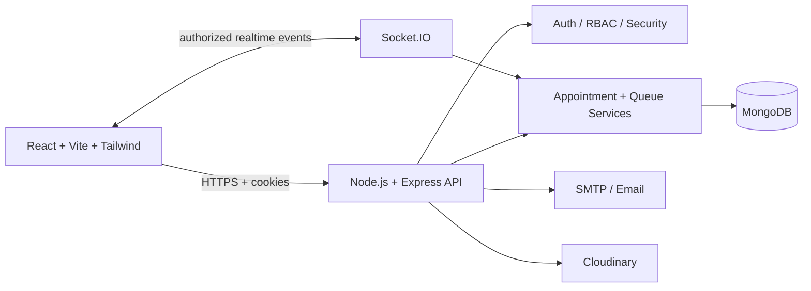

# Smart Hospital Queue System

A production-oriented full-stack hospital appointment and real-time queue management platform built with **React, Node.js, Express, MongoDB, Mongoose and Socket.IO**.

> **Portfolio project:** demonstrates backend engineering, authentication and authorization, database integrity, real-time systems, queue management, concurrency protection and production hardening. It is not certified clinical software.

## Overview

Smart Hospital Queue System models the operational flow from doctor discovery and appointment booking through token allocation, persistent FIFO queue processing and consultation completion.

```text
Patient discovers doctor
        ↓
Selects availability
        ↓
Books appointment + token
        ↓
Waits in persistent FIFO queue
        ↓
Doctor calls next patient
        ↓
Completed / missed / cancelled
        ↓
Appointment + queue state stay consistent
```

The system uses real API/database state rather than frontend mock data for operational workflows.

## Core features

### Patient
- Registration and login
- Profile setup and editing with profile image support
- Browse active doctors and departments
- View doctor bio, availability, photo and consultation fee
- Book appointments from available slots
- View appointment, token and queue status
- Cancel eligible appointments
- Rebook released slots
- View authorized medical records
- Real-time queue updates through Socket.IO
- Today/upcoming appointments and appointment history

### Doctor
- Secure login with privileged-account MFA support
- Doctor profile, bio and consultation fee management
- Availability management
- Authorized patient and appointment visibility
- Persistent FIFO queue operation
- Call Next patient
- Consultation lifecycle management
- Authorized medical-record management

### Administrator
- Protected administrative dashboard
- Doctor lifecycle management: active, inactive and suspended
- Doctor and patient management
- Department CRUD
- Appointment and operational monitoring
- Audit-log support for security-sensitive operations

## Engineering highlights

- **RBAC:** patient, doctor and admin roles with server-side authorization
- **Authentication:** short-lived JWT access tokens with HttpOnly-cookie refresh sessions
- **Session recovery:** frontend automatically refreshes an expired access token and retries the failed request when the refresh session is still valid
- **Refresh-token rotation:** refresh sessions are rotated server-side rather than storing long-lived access tokens in browser storage
- **MFA:** encrypted TOTP support for doctors and administrators
- **Database integrity:** MongoDB/Mongoose constraints and partial unique indexes for active records
- **Appointment safety:** active-only slot uniqueness while cancelled records remain historical
- **Token allocation:** safe cancelled-token reuse without renumbering active patients
- **Concurrency:** database-level constraints and atomic operations protect competing bookings
- **Queue:** persistent `QueueEntry` state and FIFO Call Next behavior
- **Real-time:** Socket.IO queue rooms with server-side authorization
- **Timezone:** centralized hospital timezone handling using `Asia/Kolkata`
- **Security:** Helmet, rate limiting, request IDs, validation, safe public errors and audit logging
- **Observability:** health/metrics endpoints, structured request context and monitoring abstraction
- **Data lifecycle:** automatic missed-appointment processing and idempotent index migration scripts
- **No operational mock data:** hospital state is driven by API, database and user actions

## Architecture



### Main domain flow

```text
Appointment
   │
   ├── booking state
   ├── doctor/date/time
   └── token number
          │
          ▼
     QueueEntry
          │
          ├── waiting
          ├── in-progress
          ├── completed
          └── cancelled

QueueCounter
   └── coordinates safe token allocation/reuse
```

## Repository structure

```text
smart--hospital--queue/
├── backend/
│   ├── src/
│   │   ├── config/
│   │   ├── controllers/
│   │   ├── middleware/
│   │   ├── models/
│   │   ├── routes/
│   │   ├── services/
│   │   ├── utils/
│   │   └── server.js
│   ├── scripts/              # migrations and operational scripts
│   └── tests/                # automated backend/unit coverage
├── frontend/
│   ├── src/
│   │   ├── components/
│   │   ├── context/
│   │   ├── layouts/
│   │   ├── pages/
│   │   ├── services/
│   │   └── utils/
│   └── public/
├── docs/                     # security, testing, deployment and engineering docs
├── scripts/                  # repository-level validation scripts
├── .github/workflows/        # GitHub Actions CI
└── README.md
```

## Live Demo

[Open Smart Hospital Queue — Live Application](https://smart-hospital-queue-zeta.vercel.app/)

## UI Documentation

The repository includes a complete **44-screenshot UI documentation PDF** covering the public landing pages, patient portal, doctor portal, admin portal, appointment flow, live queue states and email notifications. The PDF contains a named index mapping each screenshot to its corresponding page.

[View the 44-Screenshot UI Documentation](docs/Smart-Hospital-UI-Documentation.pdf)

## UI/UX and responsive design

- Responsive layouts for desktop, tablet and mobile breakpoints
- Patient, doctor and admin navigation with mobile-friendly layouts
- Admin desktop sidebar with mobile navigation drawer
- Responsive public navigation and mobile menu
- Mobile-friendly forms, cards, filters and operational views
- Doctor and patient profile images displayed from application data
- Accessible navigation labels, focus states and touch-friendly controls
- Dedicated 404 page for unknown routes
- Layouts designed to avoid horizontal viewport overflow

## Technology stack

| Layer | Technology |
|---|---|
| Frontend | React 19, Vite, Tailwind CSS, React Router |
| API | Node.js 22+, Express 5 |
| Database | MongoDB, Mongoose |
| Realtime | Socket.IO |
| Authentication | JWT, HttpOnly cookies, rotating refresh sessions |
| Security | Helmet, express-rate-limit, express-validator, MFA/TOTP |
| Files/media | Cloudinary + Multer |
| Email | Nodemailer / SMTP |
| Validation | Node test runner, Oxlint and Vite production build |
| Deployment | Vercel-compatible frontend + production backend configuration |
| CI | GitHub Actions |

## Local development

### Requirements

- Node.js 22+
- MongoDB 7+
- npm

### 1. Configure environment

Copy the safe templates:

```powershell
Copy-Item backend/.env.example backend/.env
Copy-Item frontend/.env.example frontend/.env
```

Set the required local values in both files. Never commit `.env` files or production credentials.

### 2. Install dependencies

From the repository root:

```powershell
npm ci
npm ci --prefix backend
npm ci --prefix frontend
```

### 3. Start the application

```powershell
npm run dev
```

The root command starts the backend and frontend development servers together.

### Useful validation commands

```powershell
npm test
npm run lint
npm run build
npm run check:backend
```

Package-level commands are also available under `backend/` and `frontend/`.

## Database migrations

For an existing MongoDB database created before the active-only appointment/token indexes were introduced, run the idempotent appointment-index migration before relying on cancellation/rebooking:

```powershell
npm run migrate:appointment-indexes --prefix backend
```

For legacy embedded doctor-availability data, use the availability migration described in `docs/DEPLOYMENT.md`.

Migrations are designed to update schema/index state without deleting appointment history.

## Appointment, cancellation and token integrity

The key invariant is:

```text
ACTIVE appointment
    → blocks doctor/date/time slot
    → occupies active token

CANCELLED appointment
    → remains in history
    → does not block the slot
    → does not permanently consume the token
```

Example:

```text
Before:
Token #1 = cancelled
Token #2 = active

Next safe booking:
Token #1 = new active appointment
Token #2 = unchanged
```

Concurrent requests are protected so two patients cannot create duplicate active bookings for the same constrained slot/token.

Missed appointments are automatically transitioned by the backend missed-appointment worker and removed from the active queue while remaining part of appointment history.

## Authentication and session behavior

The application uses a short-lived access token together with a longer-lived refresh session stored in an HttpOnly cookie.

```text
Request
  ↓
Access token valid? ── Yes ──→ API response
  │
  No / 401
  ↓
POST /auth/refresh
  ↓
Refresh session valid? ── Yes ──→ new access token → retry request
  │
  No
  ↓
Session ends → user must authenticate again
```

This keeps the access token short-lived while avoiding unnecessary login prompts during an otherwise valid refresh session.

## Testing and CI

The repository includes backend unit tests and GitHub Actions CI. The CI workflow validates:

1. dependency installation
2. backend JavaScript syntax
3. backend tests
4. frontend lint
5. frontend production build
6. high-severity dependency audit

Run the local checks with:

```powershell
npm run check:backend
npm test
npm run lint
npm run build
```

The repository intentionally does **not** claim automated browser E2E coverage until a real Playwright/Cypress suite is installed and executed.

See:

- `docs/TESTING.md`
- `docs/FINAL-TEST-REPORT.md`
- `docs/SECURITY.md`
- `docs/DEPLOYMENT.md`
- `docs/BACKUP-RECOVERY.md`
- `docs/FINAL-PORTFOLIO-ENGINEERING-REPORT.md`
- `docs/SRS-IMPLEMENTATION-TRACEABILITY.md`

## Security notes

Never commit:

- `.env`
- JWT secrets
- MongoDB credentials
- SMTP passwords/app passwords
- Cloudinary secrets
- production API keys

Only placeholder configuration belongs in `.env.example` files.

## Production-readiness boundary

This is a **portfolio-grade engineering project**. It demonstrates production-oriented practices, but it is not certified or approved for real clinical use.

Infrastructure-dependent capabilities must be verified in the target deployment environment, including external monitoring, backup restoration, browser E2E, Docker-based deployment and OpenAPI publication.

## Portfolio talking points

For an interview or project presentation, useful engineering discussion areas include:

- Why appointment uniqueness is enforced at the database layer
- Why cancelled records are retained but excluded from active uniqueness
- How token reuse avoids renumbering active patients
- How concurrent booking requests are protected
- Why Socket.IO is not used as the authorization boundary
- Why HttpOnly cookies are preferred over localStorage token persistence
- How doctor suspension affects sessions and operational access
- How timezone boundaries are centralized
- How migrations protect existing production data
- How automatic token refresh reduces unnecessary re-authentication without making access tokens long-lived

## License

ISC. See the root `package.json` for project metadata.
